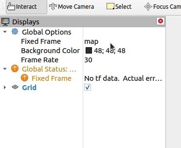

How to visualize soccer markers
###############################

This package contains nodes that convert `ROS2 Soccer Interfaces`_ msgs to `RViz Markers`_ that
allow visualization of soccer-related topics. Instructions here run each node in isolation, to run
all nodes from a launch file, see :ref:`launch_all_conversion_nodes`.

Publish test data
*****************

In a new terminal, start by simulating incoming vision data:

.. tabs::

  .. group-tab:: Ball

    .. code-block:: console

      ros2 topic pub vision/ball soccer_object_msgs/msg/Ball '{header: {frame_id: test_frame}, center: {x: 2.0, y: 1.0, z: 0.0}}'

  .. group-tab:: Goal Posts

    .. code-block:: console

      ros2 topic pub vision/goalposts soccer_object_msgs/msg/GoalpostArray "{posts: [{header: {frame_id: test_frame}, point: {x: 2.0, y: 2.0, z: 0.0}}]}"

  .. group-tab:: Field Lines

    .. code-block:: console
    
      ros2 topic pub vision/field_lines soccer_object_msgs/msg/FieldLineArray "{lines: [{header: {frame_id: test_frame}, start: {x: 3.0, y: 2.0, z: 0.0}, end: {x: 3.0, y: 1.0, z: 0.0}}]}"

  .. group-tab:: Flags

    .. code-block:: console

      ros2 topic pub vision/flags soccer_object_msgs/msg/FlagArray "{flags: [{header: {frame_id: test_frame}, base: {x: 1.0, y: 2.0, z: 0.0}}]}"

  .. group-tab:: Robots

    .. code-block:: console

      ros2 topic pub vision/robots soccer_object_msgs/msg/RobotArray "{robots: [{header: {frame_id: test_frame}, head: {x: 3.0, y: -1.0, z: 0.50}}]}"

.. note::

  In this tutorial, we're publishing data in the ``test_frame`` frame. On a real robot, this frame would most likely be
  a frame such as ``camera``, or wherever the vision data is relative to.

Run conversion node
*******************

In a new terminal, run the corresponding node to convert vision data to visualization markers:

.. tabs::

  .. group-tab:: Ball

    .. code-block:: console

      ros2 run soccer_marker_generation ball_to_marker

  .. group-tab:: Goal Posts

    .. code-block:: console

      ros2 run soccer_marker_generation goalpost_array_to_marker_array

  .. group-tab:: Field Lines

    .. code-block:: console

      ros2 run soccer_marker_generation field_line_array_to_marker_array

  .. group-tab:: Flags

    .. code-block:: console

      ros2 run soccer_marker_generation flag_array_to_marker_array

  .. group-tab:: Robots

    .. code-block:: console

      ros2 run soccer_marker_generation robot_array_to_marker_array

.. tip::

  To run all nodes from a launch file, see :ref:`launch_all_conversion_nodes`.

Open RViz
*********

In a new terminal, open RViz:

.. code-block:: console

  rviz2

Change Fixed Frame
******************

Set Global Options > Fixed Frame to ``test_frame``.

.. note::

  Ideally, fixed frame is set to ``map``, or ``world``. In this tutorial, we don't have a transform from ``test_frame`` to any of those
  frames. By setting fixed frame to ``test_frame``, we don't have to publish any transforms to visualize the data.

Add Marker to Display
*********************

.. tabs::

  .. group-tab:: Ball

    In Rviz, add a new Marker display, and set topic to ``visualization/ball``.

    .. image:: images/ball.gif

  .. group-tab:: Goalposts

    In Rviz, add a new MarkerArray display, and set topic to ``visualization/goalposts``.

    .. image:: images/goalposts.gif

  .. group-tab:: Field Lines

    In Rviz, add a new MarkerArray display, and set topic to ``visualization/field_lines``.

    .. image:: images/field-lines.gif

  .. group-tab:: Flags

    In Rviz, add a new MarkerArray display, and set topic to ``visualization/flags``.

    .. image:: images/flags.gif

  .. group-tab:: Robots

    In Rviz, add a new MarkerArray display, and set topic to ``visualization/robots``.

    .. image:: images/robots.gif

.. _ROS2 Soccer Interfaces: https://soccer-object-msgs.readthedocs.io/en/latest/
.. _RViz Markers: http://wiki.ros.org/rviz/DisplayTypes/Marker